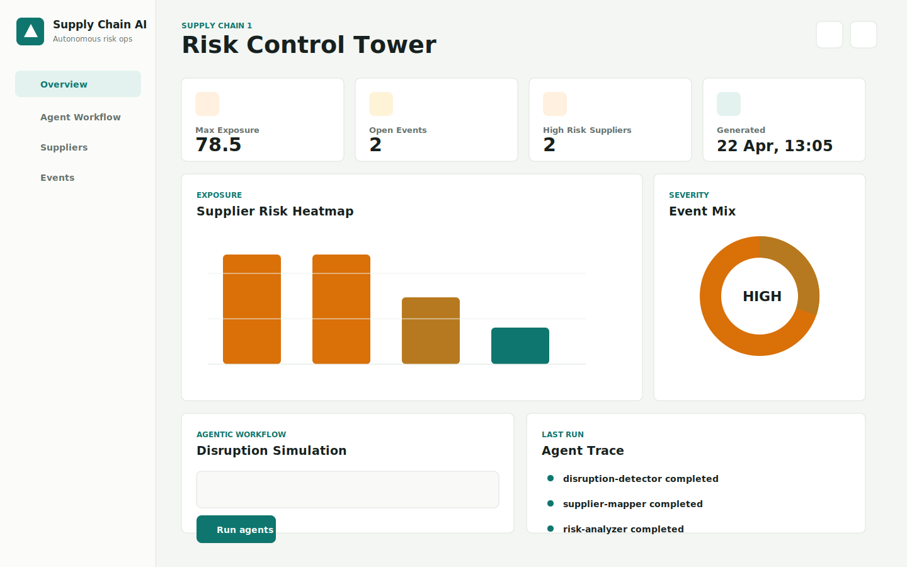
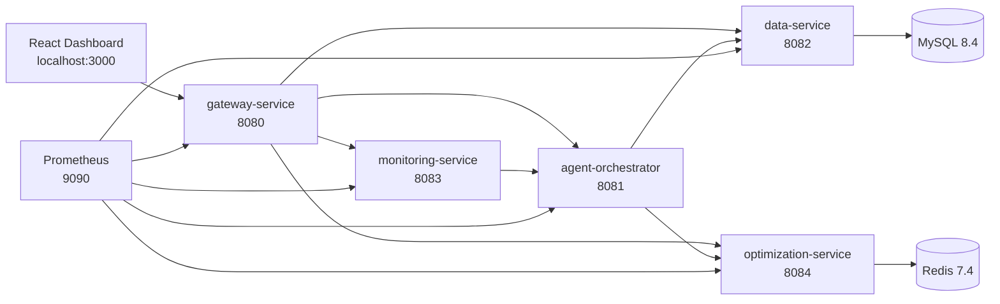
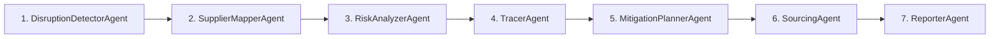

# Agentic AI-Based Autonomous Supply Chain Optimization and Disruption Management System

Production-style Spring Boot microservices platform for detecting supply-chain disruptions, mapping supplier exposure, tracing upstream/downstream impact, generating mitigation plans, and presenting executive dashboard insights.



## Highlights

- 5 Spring Boot 3.3.4 microservices
- 7-agent autonomous workflow
- Gateway routing with JWT authentication
- MySQL persistence with H2-friendly service development
- Redis-ready optimization layer
- React 18 dashboard with Chart.js
- Docker Compose stack with MySQL, Redis, Prometheus, and frontend
- Kubernetes manifests for local cluster deployment
- Swagger/OpenAPI docs through the gateway
- Local deterministic AI fallback, so the project runs without an OpenAI key

## Architecture



## Agentic Workflow



## Services

| Service | Port | Responsibility |
| --- | ---: | --- |
| gateway-service | 8080 | Spring Cloud Gateway, JWT auth, routes, Swagger aggregation |
| agent-orchestrator | 8081 | Coordinates the 7-agent workflow and dashboard APIs |
| data-service | 8082 | Owns suppliers, materials, inventory, risk events |
| monitoring-service | 8083 | WebFlux disruption/news ingestion and analysis forwarding |
| optimization-service | 8084 | Mitigation, route, inventory, and supplier scoring logic |
| frontend | 3000 | React dashboard |
| prometheus | 9090 | Metrics collection |

## Tech Stack

| Layer | Technology |
| --- | --- |
| Backend | Java 21, Spring Boot 3.3.4, Spring Cloud 2023.0.3 |
| AI architecture | Agentic workflow classes, local deterministic fallback, Spring AI adapter boundary |
| Persistence | MySQL 8.4, Spring Data JPA, H2 local fallback |
| Cache/optimization support | Redis 7.4 |
| Gateway/security | Spring Cloud Gateway, custom JWT filter, CORS |
| Frontend | React 18, Vite, Chart.js, lucide-react |
| Observability | Spring Actuator, Micrometer, Prometheus |
| API docs | SpringDoc OpenAPI 2.6.0 |
| Deployment | Docker Compose, Kubernetes manifests |

## Quick Start

Prerequisites:

- Java 21
- Maven 3.9+
- Node.js 22+
- Docker Desktop

Start the full backend stack:

```powershell
cd C:\Users\akash\Documents\Codex\2026-04-22-you-are-an-expert-spring-boot\supply-chain-agentic-ai
docker compose up -d --build
```

Start the React dashboard:

```powershell
cd C:\Users\akash\Documents\Codex\2026-04-22-you-are-an-expert-spring-boot\supply-chain-agentic-ai\frontend
npm.cmd run dev
```

Open:

```text
Dashboard:  http://localhost:3000
Swagger:    http://localhost:8080/api/docs
Prometheus: http://localhost:9090
```

Default dashboard login:

```text
username: akash
password: supplychain2026
```

## Smoke Test

Run the PowerShell smoke test:

```powershell
cd C:\Users\akash\Documents\Codex\2026-04-22-you-are-an-expert-spring-boot\supply-chain-agentic-ai
.\scripts\smoke-test.ps1
```

The script checks:

- Gateway health
- JWT token generation
- Dashboard data
- Full 7-agent disruption analysis

## Main API Calls

Get JWT:

```powershell
$login = @{
  username = "akash"
  password = "supplychain2026"
} | ConvertTo-Json

$tokenResponse = Invoke-RestMethod `
  -Uri "http://localhost:8080/auth/token" `
  -Method POST `
  -ContentType "application/json" `
  -Body $login

$token = $tokenResponse.accessToken
```

Run disruption analysis:

```powershell
$body = @{
  event = "Hurricane Taiwan may disrupt semiconductor port operations and chip shipments"
  supplyChainId = 1
} | ConvertTo-Json

Invoke-RestMethod `
  -Uri "http://localhost:8080/api/v1/analyze" `
  -Method POST `
  -ContentType "application/json" `
  -Headers @{ Authorization = "Bearer $token" } `
  -Body $body
```

Get dashboard data:

```powershell
Invoke-RestMethod `
  -Uri "http://localhost:8080/api/v1/dashboard/data" `
  -Headers @{ Authorization = "Bearer $token" }
```

## Environment

Copy `.env.example` to `.env` for local overrides:

```text
OPENAI_API_KEY=
JWT_SECRET=supplychain2026-supplychain2026-supplychain2026
GATEWAY_DEMO_USERNAME=akash
GATEWAY_DEMO_PASSWORD=supplychain2026
MYSQL_HOST_PORT=3307
REDIS_HOST_PORT=6380
```

The system works without `OPENAI_API_KEY` because the orchestrator uses a deterministic local fallback.

## Docker Notes

Compose exposes MySQL and Redis on non-default host ports to avoid common local conflicts:

```text
MySQL: localhost:3307 -> container:3306
Redis: localhost:6380 -> container:6379
```

Useful commands:

```powershell
docker compose ps
docker compose logs -f gateway
docker compose down
```

## Kubernetes

Apply manifests:

```powershell
kubectl apply -f k8s/
kubectl get pods -n supply-chain-ai
kubectl port-forward -n supply-chain-ai svc/gateway-service 8080:8080
```

Remove:

```powershell
kubectl delete namespace supply-chain-ai
```

## Documentation

- [Architecture](docs/ARCHITECTURE.md)
- [Runbook](docs/RUNBOOK.md)
- [API examples](docs/API_EXAMPLES.md)
- [Portfolio notes](docs/PORTFOLIO_NOTES.md)
- [File tree](docs/FILE_TREE.md)

## Interview Talking Points

- Shows microservices decomposition without overcomplicating local setup
- Demonstrates agentic workflow design with deterministic fallback
- Uses gateway-level auth and service routing
- Separates persistence, monitoring, orchestration, and optimization responsibilities
- Includes real deployability: Docker Compose, Kubernetes manifests, health checks, metrics
- Provides a working React dashboard connected to live backend APIs
