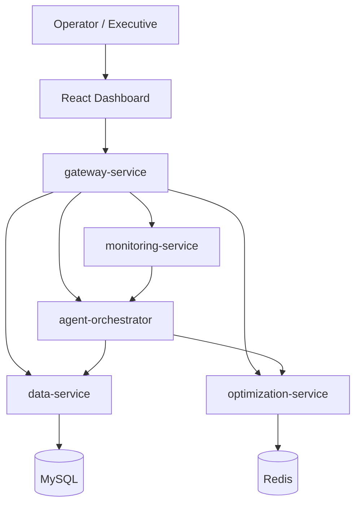

# Architecture

This project follows a small but realistic microservices architecture for autonomous supply-chain disruption management.

## Runtime View



## Service Responsibilities

| Service | Owns | Does Not Own |
| --- | --- | --- |
| gateway-service | Routing, JWT, CORS, Swagger entry point | Business logic |
| agent-orchestrator | Workflow coordination and agent sequence | Database schema |
| data-service | Supplier/material/inventory/risk persistence | AI decisions |
| monitoring-service | News/event ingestion and normalization | Procurement decisions |
| optimization-service | Route, supplier, inventory recommendation logic | Event ingestion |
| frontend | Operator workflow and visualization | Backend state |

## Agent Workflow

The orchestrator coordinates seven conceptual agents:

1. DisruptionDetectorAgent identifies event type, severity, and affected geography.
2. SupplierMapperAgent maps the event to supplier and material exposure.
3. RiskAnalyzerAgent calculates exposure score and risk level.
4. TracerAgent propagates impact across supplier/material/plant nodes.
5. MitigationPlannerAgent requests route, inventory, and sourcing alternatives.
6. SourcingAgent prepares approval-gated procurement actions.
7. ReporterAgent generates the executive summary and dashboard-ready report.

The workflow is deterministic by default, which keeps the project runnable without paid external APIs. The AI boundary is still clean enough to add Spring AI/OpenAI behavior later.

## Data Model

Core persisted entities:

- Supplier
- Material
- Inventory
- RiskEvent

The seeded supply chain represents high-impact electronics flows around semiconductor, battery, OLED display, and polymer materials.

## Observability

Every Spring Boot service exposes:

```text
/actuator/health
/actuator/prometheus
```

Prometheus scrapes all backend services through `observability/prometheus.yml`.
